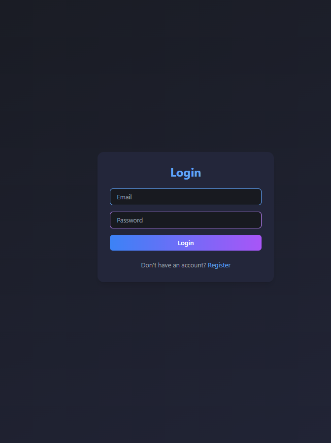
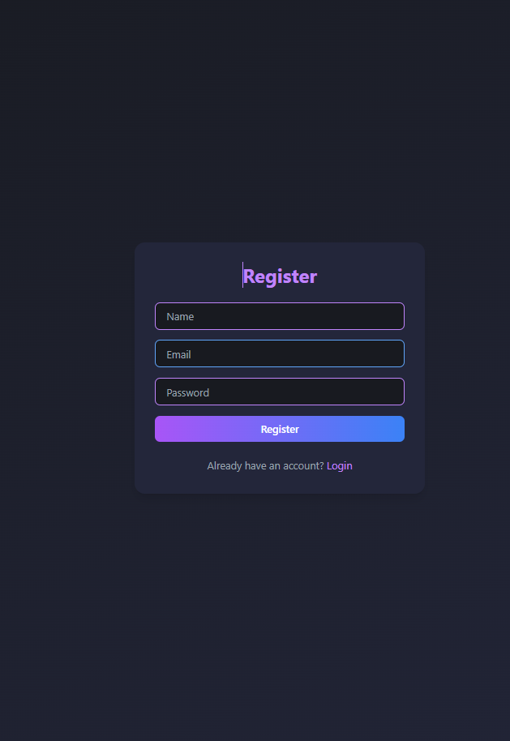
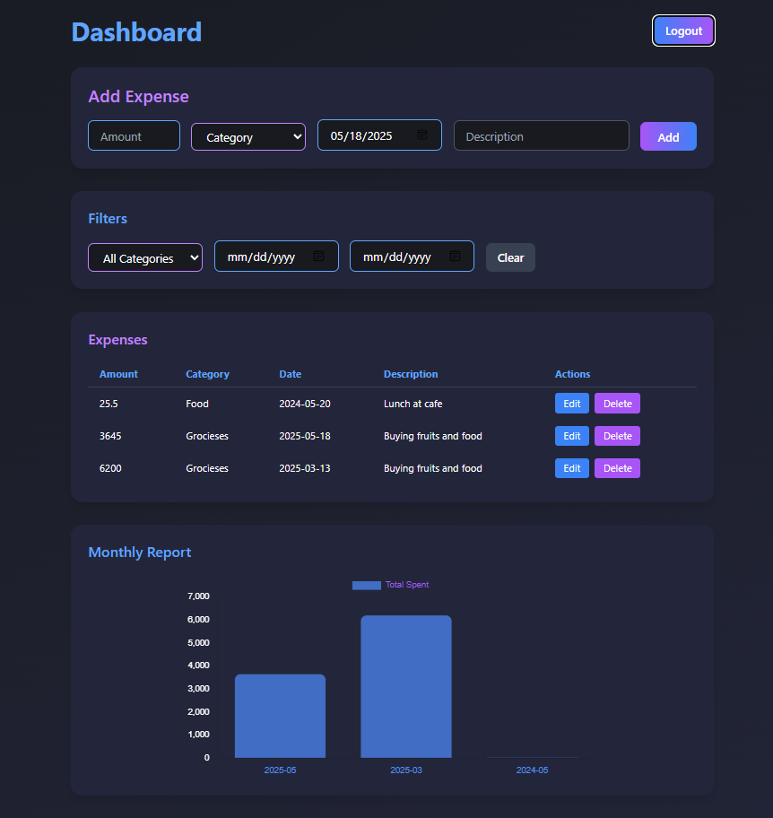

# Expense Tracker

A modern, full-stack expense tracking application with a beautiful dark mode UI, blue and purple accents, and powerful expense management features.

## Screenshots

### Login Page


### Register Page


### Dashboard


## Features

- User authentication (JWT)
- Add, edit, delete, and filter expenses
- Monthly report with interactive charts
- Responsive dark mode UI with blue and purple accents
- Built with React, TailwindCSS, Chart.js, Node.js, Express, Sequelize, MySQL

## Tech Stack

- **Frontend:** React, TailwindCSS, Chart.js, Axios, React Router
- **Backend:** Node.js, Express, Sequelize, MySQL, JWT

## Project Structure

```
expense-tracker/
├── frontend/          # React frontend application
├── backend/           # Node.js backend server
│   ├── config/       # Database and app configuration
│   ├── models/       # Database models
│   ├── migrations/   # Database migrations
│   └── seeders/      # Database seeders
```

## Getting Started

### Prerequisites
- Node.js (v16 or v18 recommended)
- MySQL
- npm

### Installation

1. **Clone the repository**
   ```bash
   git clone https://github.com/yourusername/expense-tracker.git
   cd expense-tracker
   ```
2. **Install backend dependencies**
   ```bash
   cd backend
   npm install
   ```
3. **Install frontend dependencies**
   ```bash
   cd ../frontend
   npm install
   ```
4. **Set up environment variables**
   - Create a `.env` file in the backend directory (see `.env.example` if available)
   - Example:
     ```
     DB_HOST=localhost
     DB_USER=your_mysql_username
     DB_PASSWORD=your_mysql_password
     DB_NAME=expense_tracker_db
     DB_PORT=3306
     JWT_SECRET=your_jwt_secret
     PORT=5000
     ```
5. **Run the backend**
   ```bash
   cd backend
   npm run dev
   ```
6. **Run the frontend**
   ```bash
   cd frontend
   npm start
   ```

## Contributing

1. Fork the repository
2. Create your feature branch (`git checkout -b feature/AmazingFeature`)
3. Commit your changes (`git commit -m 'Add some AmazingFeature'`)
4. Push to the branch (`git push origin feature/AmazingFeature`)
5. Open a Pull Request

## License

MIT 